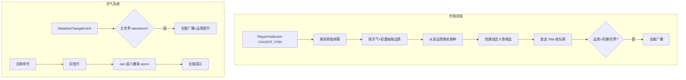

# ST Fish 钓鱼/天气系统实现计划

## 1. 架构概览




## 2. 模块结构

遵循 [RULE.md](RULE.md) 与 [module-structure.mdc](.cursor/rules/module-structure.mdc)：

```
stfish/
├── StfishModule.java
├── command/StfishCommand.java      # 召唤天气子命令
├── config/StfishConfigManager.java
├── listener/
│   ├── FishingListener.java      # PlayerFishEvent
│   └── WeatherListener.java      # WeatherChangeEvent
├── service/
│   ├── FishLootService.java      # 品质抽取、鱼种选择
│   ├── FishItemFactory.java      # 根据配置创建鱼物品（原版 ItemStack + PDC，长度在范围内随机）
│   └── WeatherService.java       # 天气召唤、广播
└── data/
    ├── FishTier.java             # 品质枚举
    └── FishDefinition.java       # 鱼种数据（id, name, description, lengthMin, lengthMax, material）
```

- 主配置：`plugins/SnowTerritory/stfish/config.yml`
- 默认配置：`default-configs/stfish/config.yml`
- 鱼种配置：`default-configs/stfish/fish.yml`（品质 -> 鱼种列表，每鱼种含 name、description、length-min、length-max、material）
- 消息：`default-configs/stfish/messages/zh_CN.yml`

## 3. 钓鱼逻辑

### 3.1 监听 PlayerFishEvent

- 监听 `PlayerFishEvent`，仅处理 `state == CAUGHT_FISH`
- 取消原版掉落：`event.setCancelled(true)` 并移除钓竿上的附魔鱼
- 仅主世界生效（与天气系统一致）

### 3.2 品质与鱼种

- 品质枚举：`COMMON(34)`, `RARE(21)`, `EPIC(18)`, `LEGENDARY(15)`, `STORM(23)`, `WORLD(14)`
- 品质权重可配置，按当前天气（storm > rain > sun）调整
- 从 `fish.yml` 按品质读取鱼种配置，随机选取一个
- 鱼物品由插件自行创建：使用原版 Material（COD/SALMON/TROPICAL_FISH 等）、自定义名称、Lore（含描述与长度），通过 PersistentDataContainer 标记为 ST 鱼并存储鱼种 ID。长度在配置的 `length-min`～`length-max` 范围内随机生成

### 3.3 钓上鱼时的提示

- **Title**：对所有品质均发送，参考 [CollectHarvestListener.sendCollectTitle](src/main/java/top/arctain/snowTerritory/quest/listener/CollectHarvestListener.java)：
  - 使用 `player.showTitle(Title.title(titleComp, subtitleComp, Title.Times.times(...)))`
  - 配置：`stfish.fish-title`、`stfish.fish-subtitle`，占位符 `{fish}`, `{tier}`
  - 时长：`title-fade-in`, `title-stay`, `title-fade-out` 可配置
- **全服广播**：仅当品质为 `STORM` 或 `WORLD` 时，向全服玩家发送广播消息
  - 配置：`stfish.broadcast-storm`, `stfish.broadcast-world`，占位符 `{player}`, `{fish}`, `{tier}`

## 4. 天气系统

### 4.1 自然天气变化

- 监听 `WeatherChangeEvent`，仅主世界
- 当变为 `rain` 或 `storm` 时：全服广播（配置消息），并设置品质提升标志/权重
- 品质期望：storm > rain > sun（通过权重表实现）

### 4.2 召唤天气命令

- 命令：`/sn weather summon [rain|storm]`（或 `/stfish weather summon`，按项目命令风格）
- 消耗：从配置读取金币数量，使用 [EconomyService](src/main/java/top/arctain/snowTerritory/reinforce/service/EconomyService.java)（新建 stfish 内 EconomyService 实例或抽到公共包）
- 结果：默认召唤 `rain`，小概率召唤 `storm`（概率可配置，如 10%）
- 召唤成功后：全服广播（配置消息），占位符 `{player}`, `{weather}`

### 4.3 配置项（全部可配置）

```yaml
# stfish/config.yml 核心结构
weather:
  summon-cost: 1000
  storm-chance: 0.1
  broadcast-on-summon: "..."

quality-weights:
  sun: { common: 50, rare: 30, epic: 12, legendary: 5, storm: 2, world: 1 }
  rain: { ... }
  storm: { ... }

title:
  fade-in: 300
  stay: 1500
  fade-out: 500
```

## 5. 鱼类数据资产

### 5.1 鱼种配置结构（不依赖 MMOItems）

每鱼种在 `fish.yml` 中定义，插件自行创建物品：

```yaml
# fish.yml 示例
common:
  - id: cod_common_01
    name: "鳕鱼"
    description: "北大西洋常见的冷水鱼"
    length-min: 0.5
    length-max: 1.2
    material: COD
  # ... 共 34 种
rare:
  - id: rare_01
    name: "银鳞鲑"
    # ...
```

- **material**：原版 Material（COD、SALMON、TROPICAL_FISH、PUFFERFISH 等）
- **length-min**、**length-max**：鱼长度范围，钓到时在此范围内随机生成实际长度，显示在 Lore
- **name**、**description**：用于物品显示名与 Lore

物品创建：`new ItemStack(material)`，设置 DisplayName、Lore，用 `PersistentDataContainer` 写入 `stfish:id`、`stfish:length`（随机值）等，便于后续识别。

### 5.2 命名规则（严格遵守）


| 品质  | 数量  | 命名约束              |
| --- | --- | ----------------- |
| 普通  | 34  | 现实鱼类名，≤5 字        |
| 稀有  | 21  | 特征+鱼种，≤5 字，无地域指向  |
| 史诗  | 18  | 同上                |
| 传说  | 15  | 同上                |
| 风暴  | 23  | 4 字，可抽象，含地域指向     |
| 世界  | 14  | 不限字数，可拟人/比喻，含地域指向 |


风格：西方幻想风。输出格式：名称 + 描述。

## 6. 主流程集成

- [config.yml](src/main/resources/default-configs/config.yml)：新增 `modules.stfish: true`
- [Main.java](src/main/java/top/arctain/snowTerritory/Main.java)：按 `isModuleEnabled("stfish")` 初始化 `StfishModule`
- [plugin.yml](src/main/resources/plugin.yml)：新增 `st.fish.use`、`st.fish.weather` 权限
- [SnowTerritoryCommand](src/main/java/top/arctain/snowTerritory/commands/SnowTerritoryCommand.java)：注册 `weather` 子命令（或由 StfishCommand 独立注册）

## 7. 关键实现要点

- **EconomyService**：stfish 模块内新建实例（与 reinforce 相同模式），用于召唤天气扣款
- **Title**：复用 Adventure `Title.title()`，与 CollectHarvestListener 一致
- **广播**：`Bukkit.getOnlinePlayers()` 遍历发送，或 `Bukkit.broadcast()`（若支持占位符）
- **鱼种配置**：`fish.yml` 中每鱼种含 `id`、`name`、`description`、`length-min`、`length-max`、`material`，钓到时在长度范围内随机，插件据此创建原版 ItemStack 并写入 PDC 标记

