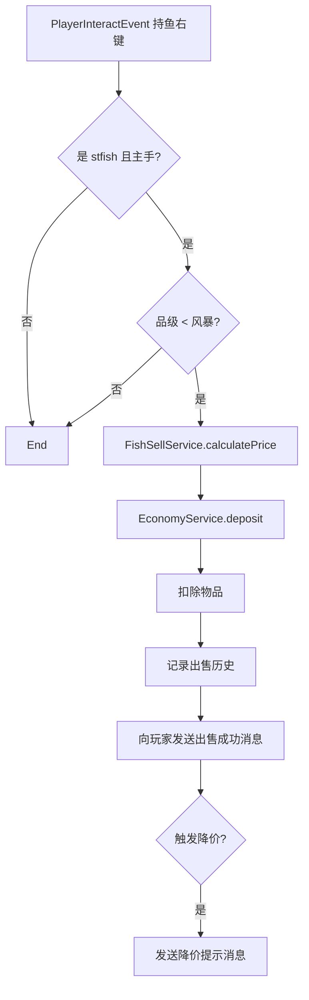

# stfish 鱼名调整与右键出售功能

## 一、鱼名调整

### 1.1 风暴级以下：15 品种统一命名

- **common 层**：仅保留 15 种鱼（鳕鱼、鲑鱼、热带鱼、河豚、鲤鱼、鲈鱼、鳟鱼、鲈鲉、鲷鱼、比目鱼、鲭鱼、鲱鱼、沙丁鱼、凤尾鱼、罗非鱼），删除其余 19 条
- **rare / epic / legendary**：每条鱼新增 `species-id` 字段，指向上述 15 个 id 之一（如 `cod_01`、`salmon_01`）
- **显示逻辑**：风暴级以下鱼的显示名 = 其 `species-id` 对应 common 鱼种的 `name`，不再使用自身 `name`
- **数据模型**：[FishDefinition](src/main/java/top/arctain/snowTerritory/stfish/data/FishDefinition.java) 增加可选 `speciesId`；[FishItemFactory](src/main/java/top/arctain/snowTerritory/stfish/service/FishItemFactory.java) 创建物品时按 `speciesId` 解析显示名

### 1.2 风暴级：天气/风暴主题命名

- 保持现有 storm 鱼种，调整 `name` 与 `lore` 使其更贴合天气、风暴、雷雨等意象（如 雷暴鳞、风暴银鳍、暴雨暗影 等）
- 配置在 [fish.yml](src/main/resources/default-configs/stfish/fish.yml) 的 `storm` 段

### 1.3 世界级：古诗词仅用于 lore

- 每条 world 鱼新增 `poem` 字段（短诗，可取自中国古诗词）
- **出货广播**：保持现有 `broadcast-world` 格式，不加入 poem
- **lore**：在 [FishItemFactory](src/main/java/top/arctain/snowTerritory/stfish/service/FishItemFactory.java) 中，world 鱼的 lore 在描述后追加该诗

---

## 二、右键出售功能

### 2.1 流程

### 2.2 价格公式

`售价 = 市场收购价 × 品级系数 × 长度系数`

- **市场收购价**：每品种（species-id）一个基础价，配置于 `config.yml` 的 `market.base-prices.{species-id}`
- **品级系数**：common=1.0, rare=1.5, epic=2.5, legendary=4.0（可配置）
- **长度系数**：`length / lengthMax` 或类似线性关系，鼓励大尺寸

### 2.3 短时出售降价

- **数据结构**：`FishMarketService` 维护「玩家 UUID → (品种, 时间戳)」的出售记录
- **规则**：在时间窗口 T（如 10 分钟）内，同一玩家出售同一品种超过 N 条（如 5 条）时，该品种对该玩家的收购价乘以衰减系数（如 0.8，可配置）
- **恢复**：超出时间窗口的出售记录可清理，价格逐步恢复

### 2.4 实现要点

| 组件                    | 说明                                                                                                          |
| --------------------- | ----------------------------------------------------------------------------------------------------------- |
| **EconomyService**    | 新增 `deposit(Player, double)`，调用 Vault `depositPlayer`                                                       |
| **FishSellService**   | 计算售价、应用降价、调用 Economy、记录出售                                                                                   |
| **FishMarketService** | 管理品种基础价、玩家出售历史、衰减逻辑                                                                                         |
| **FishSellListener**  | 监听 `PlayerInteractEvent`，主手持鱼右键时委托 FishSellService                                                          |
| **config.yml**        | 新增 `market` 段：base-prices、tier-multipliers、length-formula、decay-window-minutes、decay-threshold、decay-factor |

### 2.5 消息与校验

- **出售时向玩家发送消息**：成功出售后发送 `sell-success`（含售价、鱼名等）
- **降价提示**：若本次出售触发了短时降价，额外发送 `sell-price-decay` 提示玩家该品种收购价已下降
- 其他消息：`sell-no-economy`、`sell-storm-forbidden`、`sell-not-fish`
- 风暴级及以上鱼：在监听器中直接 return，不进入出售逻辑

---

## 三、文件变更清单

| 文件                                                                                                         | 变更                                                                      |
| ---------------------------------------------------------------------------------------------------------- | ----------------------------------------------------------------------- |
| [fish.yml](src/main/resources/default-configs/stfish/fish.yml)                                             | common 缩为 15 种；rare/epic/legendary 加 species-id；storm 调整命名；world 加 poem |
| [config.yml](src/main/resources/default-configs/stfish/config.yml)                                         | 新增 market 配置                                                            |
| [zh_CN.yml](src/main/resources/default-configs/stfish/messages/zh_CN.yml)                                  | 新增 sell-success、sell-price-decay、sell-no-economy 等消息                    |
| [FishDefinition.java](src/main/java/top/arctain/snowTerritory/stfish/data/FishDefinition.java)             | 增加 speciesId、poem 字段                                                    |
| [StfishConfigManager.java](src/main/java/top/arctain/snowTerritory/stfish/config/StfishConfigManager.java) | 解析 species-id、poem；加载 market 配置                                         |
| [FishItemFactory.java](src/main/java/top/arctain/snowTerritory/stfish/service/FishItemFactory.java)        | 风暴级以下用 species 名；world lore 加 poem                                      |
| [FishingListener.java](src/main/java/top/arctain/snowTerritory/stfish/listener/FishingListener.java)       | world 广播使用 poem                                                         |
| [EconomyService.java](src/main/java/top/arctain/snowTerritory/stfish/service/EconomyService.java)          | 新增 deposit                                                              |
| **新建** FishSellService.java                                                                                | 售价计算、出售逻辑、调用 Economy                                                    |
| **新建** FishMarketService.java                                                                              | 品种基础价、出售历史、衰减                                                           |
| **新建** FishSellListener.java                                                                               | 持鱼右键出售                                                                  |
| [StfishModule.java](src/main/java/top/arctain/snowTerritory/stfish/StfishModule.java)                      | 注册 FishSellListener，注入 FishSellService/FishMarketService                |

---

## 四、品种与 species-id 映射示例

common 保留 15 种：`cod_01`, `salmon_01`, `tropical_01`, `puffer_01`, `carp_01`, `perch_01`, `trout_01`, `bass_01`, `bream_01`, `flounder_01`, `mackerel_01`, `herring_01`, `sardine_01`, `anchovy_01`, `tilapia_01`

rare/epic/legendary 按 material 或语义映射到上述之一，例如：

- `rare_silver_01`（银鳞鲑）→ `salmon_01`
- `epic_void_01`（虚空深渊鳕）→ `cod_01`
- `leg_azure_01`（碧海龙皇）→ `tropical_01`

