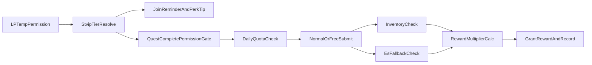

# SnowTerritory 三档 VIP 玩法与实现计划

## 目标

- 使用 LuckPerms `settemp` 的临时权限（`st.vip.1/2/3`）作为 VIP 生效和过期唯一来源。
- 将 VIP 价值聚焦在“远程效率 + 提交便利 + 容量提升 + 身份提示”，不破坏非 VIP 可玩性。
- 明确次数经济：每日 `00:00`（服务器时区）重置，避免玩家理解成本。

## 你给出的规则收敛

### 账号状态与提醒

- VIP 为限时，服主通过指令发放（推荐管理指令封装 LP 命令）。
- 玩家进服时检查剩余天数，命中 `7/3/2/1` 天任一阈值时提示。
- 进服提示中展示“当前档位的全部权益清单 + 今日剩余次数”。

### `/sn q complete` 新规则

- 非 VIP 玩家无权使用该命令（仅 OP 可绕过）。
- 普通玩家：只能给自己提交，不接受 `[player]` 参数。
- OP 与控制台：支持 `/sn q complete [player]` 可选目标参数。
- 预留兼容：你提到的“点方块触发控制台执行”不在本次实现范围，仅保证命令能力支持。

## 三档 VIP 最终权益

### VIP1

- 自动入库（白名单掉落进 ES）。
- 每天允许 4 次远程领奖（`/sn q complete` 成功计次）。
- Armor 95 折。
- 进服提示与到期倒计时提醒。

### VIP2

- 继承 VIP1 全部功能。
- `/sn q list` 显示“预提交进度”：若 ES 存在对应物品，进度条用另一种颜色叠加显示。
- `/sn q complete` 提交时：先计算手动提交，缺口部分可自动消耗 ES 补全并完成提交。
- 每天允许 8 次自动领奖。
- 额外 ES 槽位与单物品上限。
- 手动接取任务不会出现难度 `<= 8`。
- Armor 9 折。

### VIP3

- 继承 VIP2 全部功能。
- 每天允许 12 次自动领奖。
- 悬赏刷新前 5 分钟向 VIP3 提示“需求种类与数量”（仅预告，不允许提前提交）。
- 每天 4 次“免材料直接领奖”：提交时不消耗任何材料，但奖励按 `0.6` 倍发放。
- 手动接取任务不会出现难度 `<= 16`。
- Armor 8 折。

## 新花样（在你规则上追加，保持可运营）

- **到期挽留券**：剩余 3 天提醒里附“续费赠送 1 天”文案占位与按钮占位（仅消息层，不绑支付）。
- **周末双倍次数活动开关**：仅放大每日次数上限，不改基础倍率，运营风险低。
- **VIP3 悬赏情报准确率**：默认 100%，也可配置为 90%（制造一定博弈感）。
- **免材料领奖优先级提示**：每日首次登录显示“今日剩余 4 次”，强化使用心智。

## 架构与数据流

## 实现阶段

1. **Phase1：VIP 时效与提醒基建**
  - 统一读取 LP 临时权限与剩余时间。
  - 实现进服 7/3/2/1 天提醒与权益清单消息。
2. **Phase2：命令权限与目标玩家参数**
  - 重写 `/sn q complete` 的权限门禁和 `[player]` 参数解析。
  - 接入每日次数计数与 00:00 重置。
3. **Phase3：VIP2 提交增强**
  - `q list` 增加 ES 预提交进度色条。
  - 提交时 ES 自动补全缺口并扣库。
  - 手动任务难度下限过滤（VIP2）。
4. **Phase4：VIP3 高阶玩法**
  - 悬赏刷新前 5 分钟情报推送。
  - 每日 4 次免材料领奖 + 0.6 倍奖励。
  - 手动任务难度下限过滤（VIP3）。
5. **Phase5：经济统一与收口**
  - Armor 折扣统一走 stvip 档位配置（95/90/80）。
  - 增加日志字段：提交来源、是否免材料、消耗来源、剩余次数。

## 重点改动文件（后续实现）

- [StvipService.java](d:/SourceFiles/IdeaProjects/SnowTerritory/src/main/java/top/arctain/snowTerritory/stvip/service/StvipService.java)
- [StvipConfigManager.java](d:/SourceFiles/IdeaProjects/SnowTerritory/src/main/java/top/arctain/snowTerritory/stvip/config/StvipConfigManager.java)
- [StvipJoinListener.java](d:/SourceFiles/IdeaProjects/SnowTerritory/src/main/java/top/arctain/snowTerritory/stvip/listener/StvipJoinListener.java)
- [QuestCommand.java](d:/SourceFiles/IdeaProjects/SnowTerritory/src/main/java/top/arctain/snowTerritory/quest/command/QuestCommand.java)
- [QuestServiceImpl.java](d:/SourceFiles/IdeaProjects/SnowTerritory/src/main/java/top/arctain/snowTerritory/quest/service/QuestServiceImpl.java)
- [LootStorageService.java](d:/SourceFiles/IdeaProjects/SnowTerritory/src/main/java/top/arctain/snowTerritory/enderstorage/service/LootStorageService.java)
- [LootStorageServiceImpl.java](d:/SourceFiles/IdeaProjects/SnowTerritory/src/main/java/top/arctain/snowTerritory/enderstorage/service/LootStorageServiceImpl.java)
- [ArmorCostService.java](d:/SourceFiles/IdeaProjects/SnowTerritory/src/main/java/top/arctain/snowTerritory/armor/service/ArmorCostService.java)

## 关键默认值（本计划默认）

- 每日次数重置：服务器时区 `00:00`。
- 自动领奖计次口径：仅“成功发奖”才扣次数。
- 免材料领奖计次口径：仅“成功发奖且走免材料模式”才扣专属次数。
- 悬赏预告对象：仅当前在线 VIP3 玩家。

