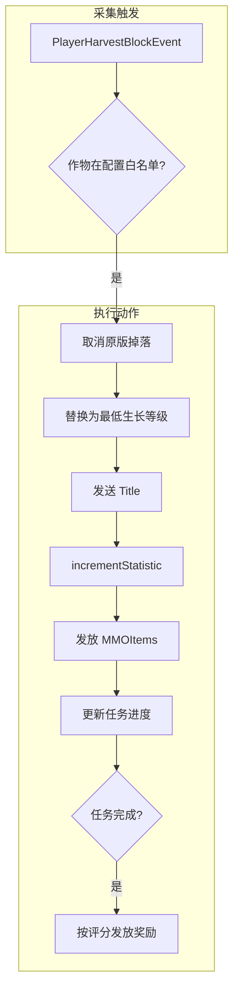

# 采集任务（COLLECT）功能实现计划

## 1. 架构概览




## 2. 配置设计

### 2.1 作物白名单 `quest/crops/whitelist.yml`

结构参考 [materials/whitelist.yml](src/main/resources/default-configs/quest/materials/whitelist.yml)，每作物配置：

```yaml
crops:
  WHEAT:
    display-name: "小麦"
    mmo-type: "MATERIAL"
    mmo-id: "优质小麦"
    min: 16
    max: 64
    crop-level: 1
  CARROTS:
    # ...
```

- `display-name`: 任务描述用
- `mmo-type` / `mmo-id`: 采集后发放的 MMOItems
- `min` / `max` / `crop-level`: 与材料任务一致，用于任务生成

### 2.2 采集任务参数 `quest/tasks/collect.yml`

复用 material.yml 结构，如 `default-time-limit`。

## 3. 核心实现

### 3.1 采集任务生成器 `CollectQuestGenerator`

- 路径：`quest/service/generator/CollectQuestGenerator.java`
- 逻辑与 [MaterialQuestGenerator](src/main/java/top/arctain/snowTerritory/quest/service/generator/MaterialQuestGenerator.java) 一致，从 `crops/whitelist.yml` 随机选作物
- `materialKey` 使用 `CROP:WHEAT` 格式，与材料任务区分
- 在 [QuestServiceImpl.initializeGenerators()](src/main/java/top/arctain/snowTerritory/quest/service/QuestServiceImpl.java) 中注册 `QuestType.COLLECT`

### 3.2 采集监听器 `CollectHarvestListener`

- 路径：`quest/listener/CollectHarvestListener.java`
- 监听 `PlayerHarvestBlockEvent`（Paper 1.21 专用）
- 流程：
  1. 校验 `getHarvestedBlock()` 为 Ageable 且 `getAge() == getMaximumAge()`
  2. 根据 `Block.getType()` 查作物白名单，无配置则放行原版逻辑
  3. `event.setCancelled(true)` 取消原版掉落
  4. 将方块 `BlockData` 设为 `setAge(0)`
  5. `player.sendTitle()` 发送采集成功消息（配置 key：`quest.collect-success`）
  6. `player.incrementStatistic(Statistic.MINE_BLOCK, blockType)` 增加统计
  7. 用 `MMOItems.plugin.getMMOItem()` 获取物品，参考 [ReinforceGuiListener](src/main/java/top/arctain/snowTerritory/reinforce/listener/ReinforceGuiListener.java) 的 `addItemToInventory` + 背包满时 `dropItemNaturally` + 发送 `inventory-full` 警告
  8. 调用 `questService.updateCollectQuestProgress(playerId, cropKey, 1)`
  9. 若任务完成，调用 `completeQuest`（普通任务）或设置 COMPLETED 状态（悬赏任务）

### 3.3 任务进度与完成

- 在 [QuestServiceImpl](src/main/java/top/arctain/snowTerritory/quest/service/QuestServiceImpl.java) 中：
  - 新增 `updateCollectQuestProgress(UUID playerId, String cropKey, int amount)`，或复用 `updateQuestProgress` 并扩展 `isMatchingMaterialQuest` 为 `isMatchingQuest`，支持 `QuestType.COLLECT` 且 `materialKey.equals(cropKey)`
  - 将 `isMatchingMaterialQuest` 重命名为 `isMatchingQuest`，增加 `quest.getType() == QuestType.COLLECT && quest.getMaterialKey().equals(key)` 分支
- 完成逻辑与材料任务相同：普通任务直接 `completeQuest` 发放奖励；悬赏任务设置 COMPLETED，玩家用 `/sn q complete` 领取

### 3.4 配置与消息

- [QuestConfigManager](src/main/java/top/arctain/snowTerritory/quest/config/QuestConfigManager.java)：新增 `getCropsWhitelist()`、`getTasksCollect()`，在 `ensureDefaults` 中复制 `quest/crops/whitelist.yml`、`quest/tasks/collect.yml`
- [zh_CN.yml](src/main/resources/default-configs/quest/messages/zh_CN.yml)：新增 `quest.collect-success`（Title 用，如 `"&a采集成功"`、`"&7+1 {crop}"`）
- 悬赏配置 [bounty/config.yml](src/main/resources/default-configs/quest/bounty/config.yml)：`allowed-types` 支持 `COLLECT` 或 `MATERIAL,COLLECT`

## 4. 作物类型映射

支持的 Ageable 作物（Material）：`WHEAT`、`CARROTS`、`POTATOES`、`BEETROOTS`、`NETHER_WART`、`SWEET_BERRY_BUSH`、`COCOA`。配置 key 使用 `Material.name()`（如 `WHEAT`）。

## 5. 文件变更清单


| 操作  | 路径                                                   |
| --- | ---------------------------------------------------- |
| 新增  | `quest/service/generator/CollectQuestGenerator.java` |
| 新增  | `quest/listener/CollectHarvestListener.java`         |
| 新增  | `quest/crops/whitelist.yml`                          |
| 新增  | `quest/tasks/collect.yml`                            |
| 修改  | `QuestServiceImpl.java`（注册生成器、扩展进度匹配）                |
| 修改  | `QuestConfigManager.java`（加载作物与 collect 配置）          |
| 修改  | `QuestModule.java`（注册 CollectHarvestListener）        |
| 修改  | `quest/messages/zh_CN.yml`（collect-success）          |
| 修改  | `quest/bounty/config.yml`（可选，支持 COLLECT）             |
| 修改  | `QuestCommand.java`（accept 时支持 type=COLLECT）         |


## 6. 注意事项

- **Paper 依赖**：`PlayerHarvestBlockEvent` 为 Paper 独有，需确认 `paper-api` 依赖
- **执行顺序**：监听器使用 `EventPriority.NORMAL`，确保与其他插件兼容
- **背包满**：复用 reinforce 的 `addItemToInventory` 逻辑，可提取到 `QuestUtils` 或公共工具类避免重复

