# SnowTerritory 插件逻辑流程图

本文档详细描述了 SnowTerritory 插件的完整逻辑判定流程，包括 Reinforce（强化）模块和 EnderStorage（末影存储）模块。

## 目录

1. [插件启动流程](#1-插件启动流程)
2. [Reinforce 模块命令执行流程](#2-reinforce-模块命令执行流程)
3. [EnderStorage 模块命令执行流程](#3-enderstorage-模块命令执行流程)
4. [GUI 交互流程](#4-gui-交互流程)
5. [强化判定核心流程](#5-强化判定核心流程)
6. [概率计算流程](#6-概率计算流程)
7. [EnderStorage 操作流程](#7-enderstorage-操作流程)

---

## 1. 插件启动流程

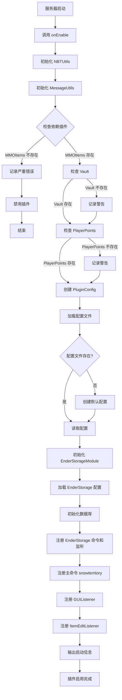

---

## 2. Reinforce 模块命令执行流程

### 2.1 /sn r 或 /sn reinforce 命令流程

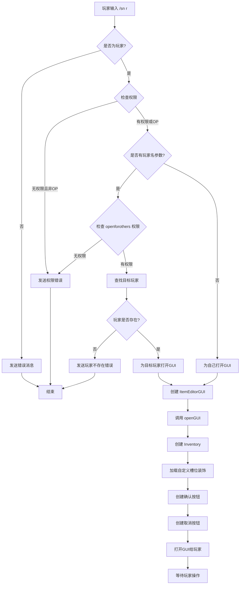

### 2.2 /sn reload 命令流程

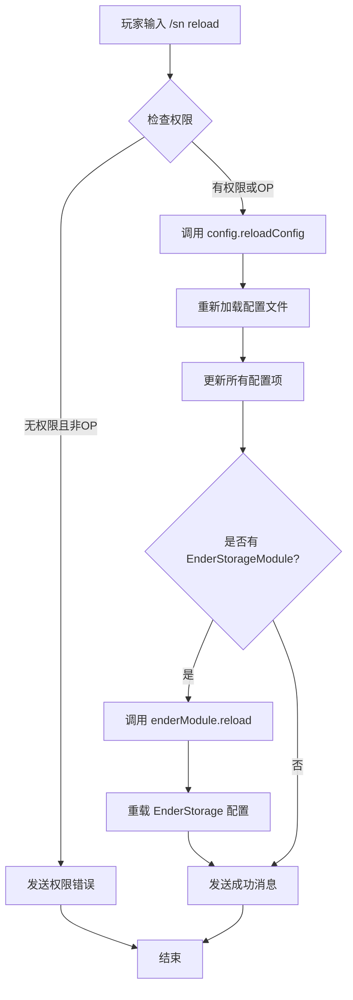

### 2.3 /sn checkid 命令流程

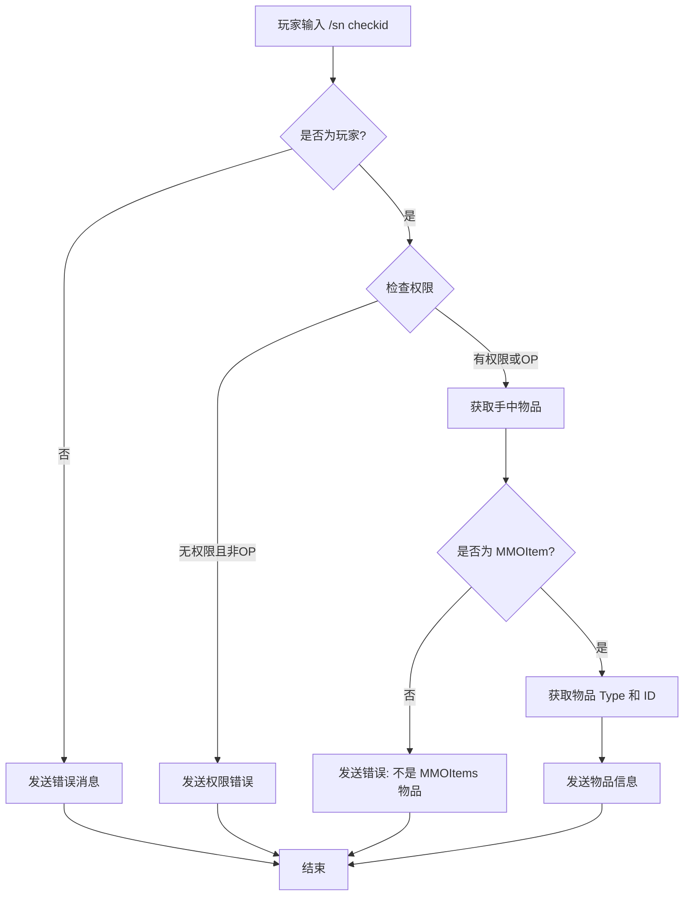

---

## 3. EnderStorage 模块命令执行流程

### 3.1 /sn es 或 /stes 命令流程

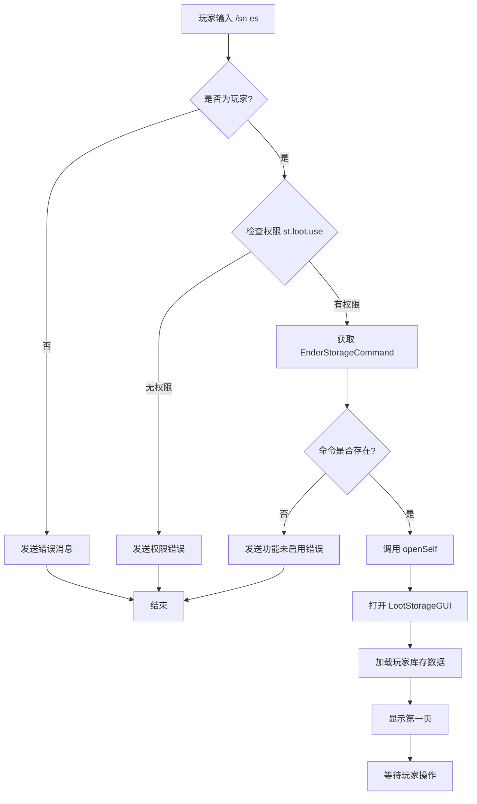

### 3.2 /sn es reload 命令流程

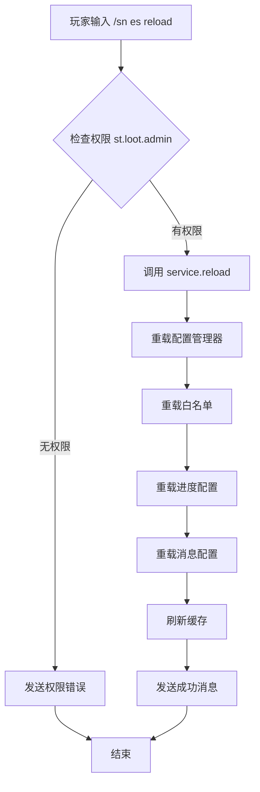

### 3.3 /sn es give 命令流程

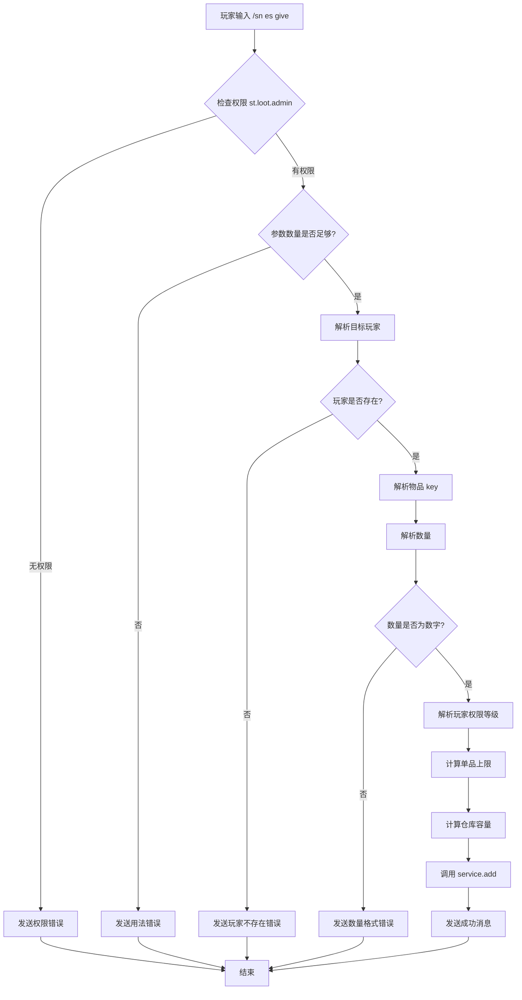

---

## 4. GUI 交互流程

### 4.1 Reinforce GUI 交互

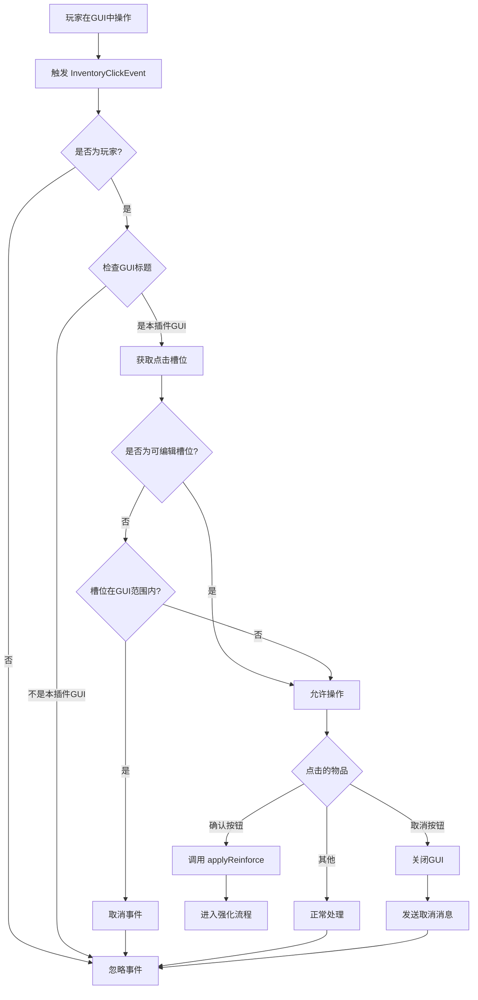

### 4.2 EnderStorage GUI 交互

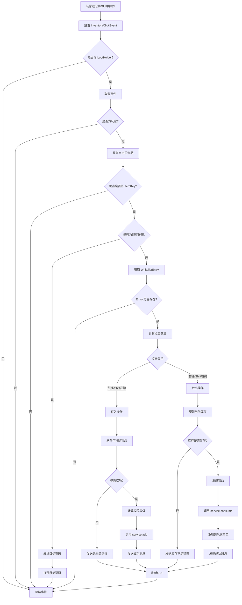

---

## 5. 强化判定核心流程

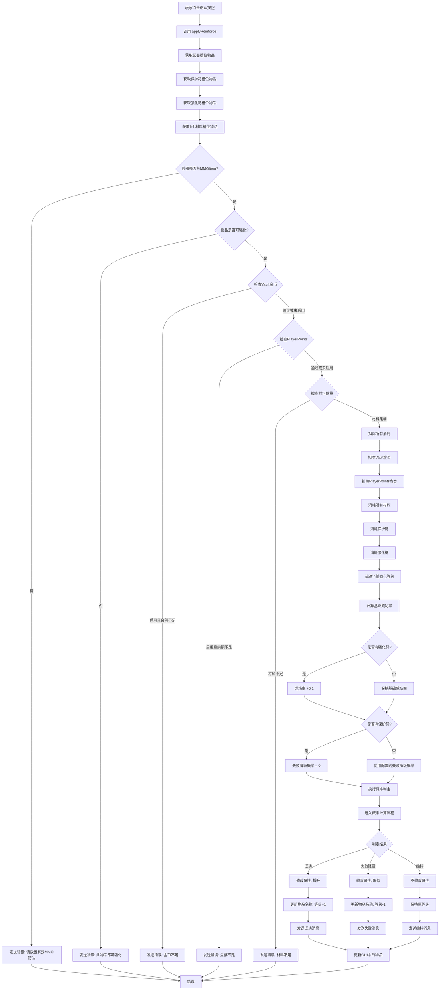

---

## 6. 概率计算流程

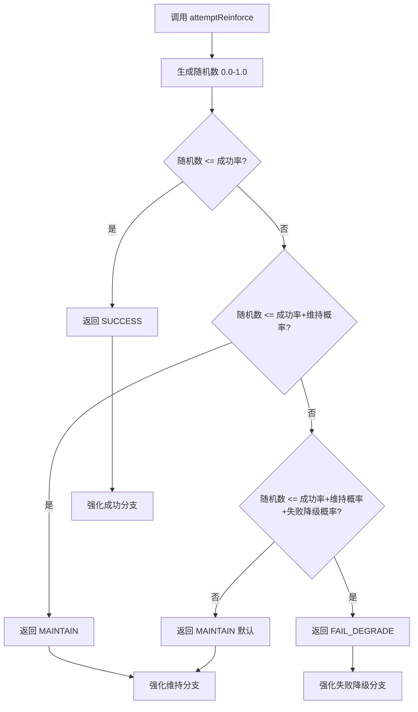

---

## 7. EnderStorage 操作流程

### 7.1 自动拾取流程

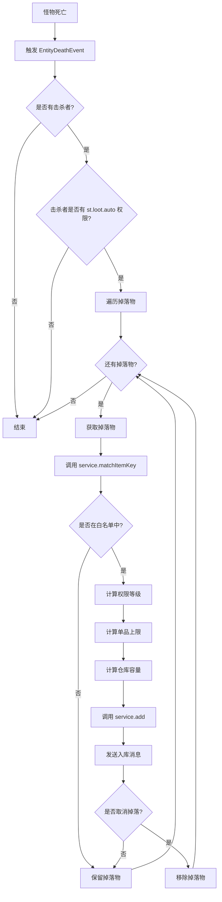

### 7.2 存入物品流程

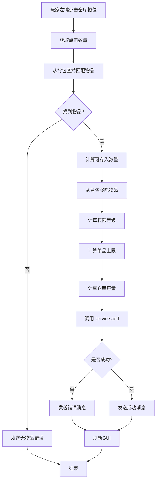

### 7.3 取出物品流程

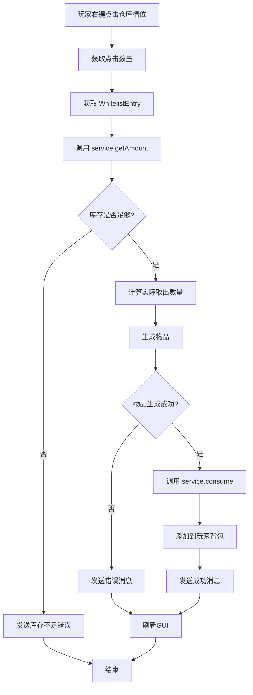

---

## 关键判定点总结

### 1. 权限判定
- Reinforce 模块：玩家必须拥有 `mmoitemseditor.edit` 权限或是 OP
- EnderStorage 模块：玩家必须拥有 `st.loot.use` 权限才能打开仓库
- 管理命令：需要 `st.loot.admin` 权限

### 2. 物品判定
- 强化物品必须存在且不为空气
- 强化物品必须是有效的 MMOItems 物品
- 强化物品必须在可强化列表中（如果列表不为空）
- 存储物品必须在白名单中

### 3. 消耗判定
- Vault 金币：如果启用，必须足够
- PlayerPoints 点券：如果启用，必须足够
- 材料：必须达到配置的数量要求

### 4. 概率判定
- 成功率：根据当前等级从配置读取
- 强化符：增加 0.1 成功率
- 保护符：将失败降级概率设为 0
- 维持概率：从配置读取

### 5. 容量判定
- 仓库容量：根据 `st.loot.size.X` 权限计算
- 单品上限：根据 `st.loot.stack.X` 权限计算
- 存入时检查容量和上限

### 6. 结果处理
- **强化成功**：属性提升，等级+1
- **强化失败降级**：属性降低，等级-1（有保护符则不降级）
- **强化维持**：属性不变，等级不变
- **存入成功**：物品从背包移除，添加到仓库
- **取出成功**：物品从仓库移除，添加到背包

---

## 配置影响点

1. **成功率配置**：影响 `attemptReinforce` 的判定
2. **消耗配置**：影响经济检查逻辑
3. **GUI配置**：影响界面布局和槽位
4. **可强化物品列表**：影响 `isReinforceable` 判定
5. **白名单配置**：影响物品是否可以存入仓库
6. **容量解锁配置**：影响仓库容量和单品上限

---

**流程图说明**：
- 菱形：判定节点（if/else）
- 矩形：处理节点（方法调用）
- 圆角矩形：开始/结束节点
- 箭头：流程方向

